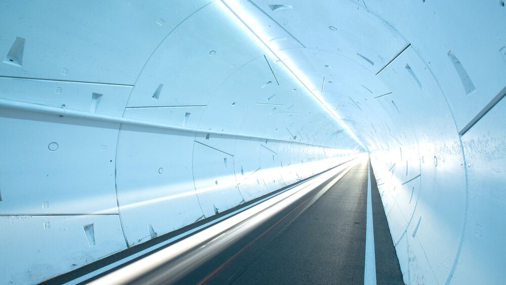
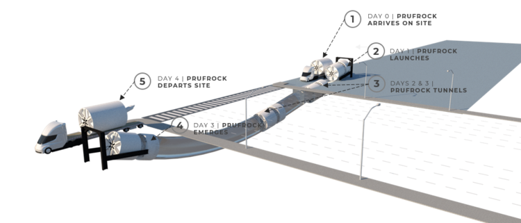
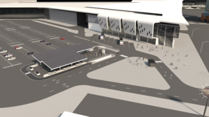
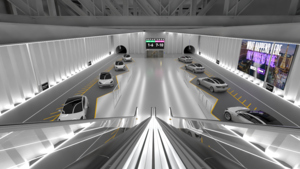
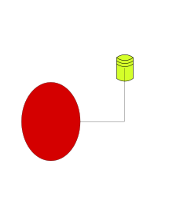
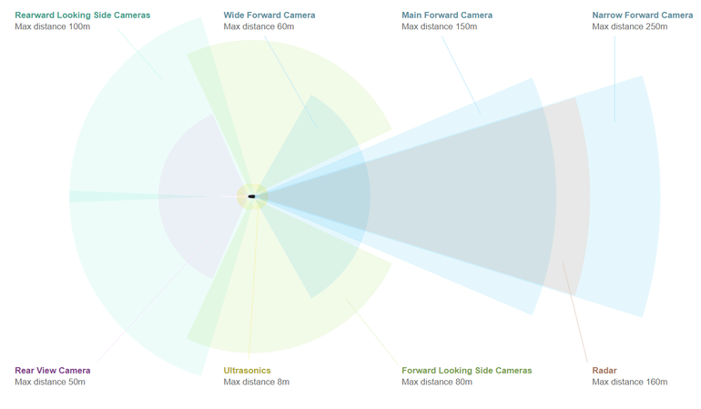

# Boring Company Demo

## Description
The Purpose of this project is to evaluate the overall system requirements for the boring company's transportation network and provide a feature [Demo](##Demo). 

#### General Notes
- All Diagrams/Illistrations were created with the free program [Inkscape](https://inkscape.org/) and are stored as svg's in the [illistrations](./illistrations) folder. 

<hr/>

## Boring Company Objectives

Provide method's of increasing transportation rates via: 
- Electric Vehicle Sub Surface Transportation
- Hyper Loop Sub Surface Transportation

## Initial Observations
- Use smaller single size diameter tunnels (12ft inner)
- Tunnels will only support a single lane
- Ideal Automobile Maximum Velocity 150mph
- Rail Guides are provided for tunnel usage
- Moving to surface launch and porpoising for entrance and exit







## My Initial Assumptions
- Smaller Equipment/Tunnels is ideal will reduce cost and complexity
- Retain Bumper Rails for all transport
- Surface launch and porpoising will make entry and exit flow rate higher
- Greatess complexity will be tunnel transitions and end points
- Minimum aproach to hardware requirements
    - Wireless Accesspoints (Communication)
    - Video (Localization)
    - Air Quality Sensors (Saftey)
    - Ventilation Management (Saftey)
    - Lighting (General and Emergency Egress)

### The Evaluation will include:
- [Traffic Control Architecture](## "Traffic Control Architecture")
- [Automotive Embedded Architecture](## "Automotive Embedded Architecture")
- [Network Software Architecture](## "Network Software Architecture")
- [Network Hardware Architecture](## "Network Hardware Architecture")
- [Summary](##Summary)
- [Demo](##Demo)

<hr/>
<hr/>

<!-- ## Diagrams
 -->

## Traffic Control Architecture

### Intro

Given all of the available information I beleive that it is possible to create a deterministic traffic control system.

We have the capability to fully control the vehicles as well as know all pertinant information to understand the kinematics and kinetics of the vehicles and their relation between each other and the tunnel system structure.

The determined pysical tunnel system structure will be the most challenging aspect of the project, for it will be the most limiting factor in performace.

My assumption is that the vehicles and tunnel monitoring system will simulataneously determine if collisions will occure inorder to avoid them, the tunnel monitoring system will determine position, velocity and acceleration of the entire vehicle set to provide a smooth and seemless experience.

<hr/>

### Existing Tesla Sensors

"Forward-looking radar: The radar used by Autopilot can see up to 160m ahead of the car, through "sand, snow, fog--almost anything," according to Musk. Radar is the primary sensor used to detect the vehicle's surroundings, along with the front-facing cameras.

Eight cameras: The four forward-facing cameras on the windshield of the car serve as a backup to the radar. The cameras consist of a narrow camera that captures footage 250m in front, a main camera that captures 150m in front, a wide-angle camera that captures 60m in front, and a camera that captures footage 80m in front and to the side of the car. The wide-angle camera is designed to read road signs and traffic lights, allowing the car to react accordingly, however, there is debate over whether this feature is enabled in cars with Autopilot 2.0 hardware. A pair of rear cameras captures footage up to 100 meters to the rear and the rear sides of the car.

Sonar: A 360-degree, ultrasonic sonar detects obstacles in an eight-meter radius around the car. The ultrasonic sensors can spot objects like a child or a dog, and work at any speed. This feature can also detect objects in blind spots and assist the car when automatically switching lanes."



Tesla existing collision avoidance should be the last measure against collision, the tunnel traffic managing system should avoid all possible occurances, but constant communication between each other is required inorder to update kinematic data for state synchronicity. 

### How Can Tunnels Transition Between Each Other?

The greatest challenge here is to provide a method of connecting tunnels together. Without this ability the pathing inefficency of the project would explode, rendered the project usless.

Possible methods:

1. Retain Standard Diameter Tunnels with Non Tunnel Based Transitions (likely/Not Ideal)
    - Like a traditional sub surface construction, looks like a box with two entrances, two exits in parrallel with each other and moving in the same direction.
    - Pros
        - Doesn't Require Special Transitions
        - Easier engineering design 
        - Easier to connect entry/exit tunnels
    - Cons
        - In general this will be the most time consuming and labor intensive aspect of construction.
        - Will slow construction immensely.
        - Cannot connect existing tunnels at a later time.
        - Expensive.
2. Retain Standard Diameter Tunnels with Traffic Mixing Valves (Most likely/Ideal)
    - It would consist of two entrances, two exits in parrallel with each other and moving in the same direction.
    - Pros
        - Retains Current Tunnel Architecture
        - Retains Current Boring Machine
        - Provide ability for post installation transitions (Add connections to existing tunnels)
    - Cons
        - A New Concrete Connection and Installation Machine would need to be developed for the mixing valve, this will be a very difficult mechanical engineering feat.
        - But worth it.

Both can be modeled in the same matter what differs is only in the method of construction.

<hr/>
<hr/>

### Traffic Control 

While looking into existing traffic control systems, I noticed that they are stoicastic in design. This is not ideal for saftey and control. Given our control of all the parameters we can create a deterministic architecture.

<hr/>

#### Tunnel System Components
1. Entry/Queue
    - street to entry queue
    - external traffic will dictate queue size 
    - can be below or/and above ground
    - porposing
2. Tunnels
    - straight
    - curved
    - spiral
    - loops (queues/buffer/transition hub)
3. Tunnel Transitions (mixing valve)
    - minimize params
    - provide a saftey buffer
4. Exit/Queue
    - exit to street queue
    - external traffic will dictate queue size
    - can be below or/and above ground
    - porposing

#### Saftey/Emergency

All conditions will require overall system awareness, redirection of vehicles and worse case cenario allow egress of passenegers.

1. Vehicle Failure
    - Stopped
    - Fire
2. HVAC Failure
    - Shut Down
3. Egress
    - Lighting Directions to nearess escape hatch

<hr/>
<hr/>

### Database Structure

#### Tunnel Static State (Database > SQL)
- id (primary key)
- global reference point (x,y,z / long, lat, sea level)
- tunnel segment id entry list/tree
- tunnel segment id exit list/tree

#### Tunnel Physics Static Limitations (Database > SQL)
- id (primary key)
- Tunnel System id (foreign key)
- allow banking construction (0/1) to reduce transitional loads on passengers in turns
- allowable sliding force/ centripital acceleration on humans
- max velocity (150 mi/hr)
- max bank angle (deg)
- max tunnel turning radius (ft)
- max tunnel rise (ft/ft)

#### Tunnel Segment Static State (Database > SQL)
- id (primary key)
- Tunnel System id (foreign key)
- type (tunnel/tunnel transition)
- is an Entry or Exit (0/1) (default 0 = not)
- entry/exit (0/1)
- contains emergency egress (0/1)
- reference positions (x,y,z) starting points
- path and plane rotation function (f(x,y,z,ϴ))
- design velocity (mi/hr) (0 < 50 < 100 < 150)
- previous segment id (foreign key)
- next segment id (foreign key)

#### Tunnel Segment Dynamic State (Database > Redis)
- segment id (foreign key)
- direction (+/-, 0/1) to reference points
- emergency egress in use (0/1)
- blocked (0/1)
- occupancy list (list of current automobile id's inorder)
- timestamp (t)

#### Tunnel System Entry Queue State (Database > Redis)
- segment id (foreign key)
- occupancy list (list of current automobile id's inorder)
- timestamp (t)

<hr/>

#### Automobile Static State (Database > SQL)
- id (primary key)
- model id (name)
- width (w)
- height (h)
- maximum velocity (v max)
- maximum acceleration (a max)
- maximum deacceleration (a dmax)
- battery state
    - maximum capacity

#### Automobile Dynamic State (Database > Redis)
- automobile id (foreign key)
- battery state
    - remaining capacity
- position (x,z,y)
- velocity (v)
- acceleration (a)
- disabled (True/False/Conditional)
- timestamp (t)
- distance headway (ft) (automobile in front)

#### Automobile Dynamic Path State (Database > Redis)
- automobile id (foreign key)
- permitted to enter system (0/1)
- segment id list (foreign key single linked, list in order) first is current
- timestamp (t)

<hr/>


<hr/>
<hr/>

## Automotive Embedded Architecture

<hr/>
<hr/>

## Network Software Architecture

<hr/>
<hr/>

## Network Hardware Architecture

<hr/>
<hr/>

## Demo

[Demo Production Link]()

<hr/>
<hr/>

## Authors

**Thomas Claydon**
<br>
[GitHub](https://github.com/gittc100)
<br>
[Website](https://www.thomasclaydon.com)

<!-- # Project Title

One Paragraph of project description goes here

## Getting Started

These instructions will get you a copy of the project up and running on your local machine for development and testing purposes. See deployment for notes on how to deploy the project on a live system.

### Prerequisites

What things you need to install the software and how to install them

```
Give examples
```
### Installing

A step by step series of examples that tell you how to get a development env running

Say what the step will be

```
Give the example
```

And repeat

```
until finished
```

End with an example of getting some data out of the system or using it for a little demo

## Running the tests

Explain how to run the automated tests for this system

### Break down into end to end tests

Explain what these tests test and why

```
Give an example
```

### And coding style tests

Explain what these tests test and why

```
Give an example
```

## Deployment

Add additional notes about how to deploy this on a live system

## Built With

* [Dropwizard](http://www.dropwizard.io/1.0.2/docs/) - The web framework used
* [Maven](https://maven.apache.org/) - Dependency Management
* [ROME](https://rometools.github.io/rome/) - Used to generate RSS Feeds

## Contributing

Please read [CONTRIBUTING.md](https://gist.github.com/PurpleBooth/b24679402957c63ec426) for details on our code of conduct, and the process for submitting pull requests to us.

## Versioning

We use [SemVer](http://semver.org/) for versioning. For the versions available, see the [tags on this repository](https://github.com/your/project/tags). 

## Authors

* **Billie Thompson** - *Initial work* - [PurpleBooth](https://github.com/PurpleBooth)

See also the list of [contributors](https://github.com/your/project/contributors) who participated in this project.

## License

This project is licensed under the MIT License - see the [LICENSE.md](LICENSE.md) file for details

## Acknowledgments

* Hat tip to anyone whose code was used
* Inspiration
* etc -->
