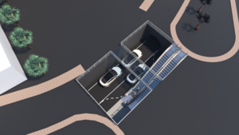

# Boring Company Demo

## Description
The Purpose of this project is to evaluate the overall system requirements for the boring company's transportation network and provide a feature [Demo](##Demo). 

#### General Notes
- All Diagrams/Illistrations were created with the free program [Inkscape](https://inkscape.org/) and are stored as svg's in the [illistrations](./illistrations) folder. 

<hr/>

## Boring Company Objectives

Provide method's of increasing transportation rates via: 
- Electric Vehicle Sub Surface Transportation
- Hyper Loop Sub Surface Transportation

## Initial Observations
- Use smaller single size diameter tunnels (12ft)
- Tunnels will only support a single lane
- Ideal Electric Vehicle Maximum Velocity 150mph
- Mixture Between railed/free electric vehicle tunnels
- Moving to surface launch and porpoising for entrance and exit




## My Initial Assumptions
- Smaller Equipment/Tunnels is ideal will reduce cost and complexity
- Currently using bumper rails for high speeds will eventualy move to railless?
- Surface launch and porpoising will make entry and exit speed's higher
- Greatess complexity will be tunnel transitions and end points
- Minimum aproach to hardware requirements
    - Wireless Accesspoints
    - Video/Audio
    - Air Quality Sensors
    - Ventilation Management
    - lighting

### The Evaluation will include:
- [Traffic Control Architecture](## "Traffic Control Architecture")
- [Automotive Embedded Architecture](## "Automotive Embedded Architecture")
- [Network Software Architecture](## "Network Software Architecture")
- [Network Hardware Architecture](## "Network Hardware Architecture")
- [Summary](##Summary)
- [Demo](##Demo)

<hr/>

<!-- ## Diagrams
 -->

## Traffic Control Architecture

### Existing Tesla Sensors

Forward-looking radar: The radar used by Autopilot can see up to 160m ahead of the car, through "sand, snow, fog--almost anything," according to Musk. Radar is the primary sensor used to detect the vehicle's surroundings, along with the front-facing cameras.

Eight cameras: The four forward-facing cameras on the windshield of the car serve as a backup to the radar. The cameras consist of a narrow camera that captures footage 250m in front, a main camera that captures 150m in front, a wide-angle camera that captures 60m in front, and a camera that captures footage 80m in front and to the side of the car. The wide-angle camera is designed to read road signs and traffic lights, allowing the car to react accordingly, however, there is debate over whether this feature is enabled in cars with Autopilot 2.0 hardware. A pair of rear cameras captures footage up to 100 meters to the rear and the rear sides of the car.

Sonar: A 360-degree, ultrasonic sonar detects obstacles in an eight-meter radius around the car. The ultrasonic sensors can spot objects like a child or a dog, and work at any speed. This feature can also detect objects in blind spots and assist the car when automatically switching lanes.


### How Can Tunnels Transition Between Each Other?

1. Provide Larger Diameter Tunnels with Wyes (Least likely/Least Ideal)
    - Pros
        - Provide Multi Lane Tunnels > 2
        - Provides speed transiton lanes equal to normal highways
        - Easier to connect entry/exit tunnels via wyes
    - Cons
        - A New Concrete Connection would need to be developed for the wye
        - Larger Boring Machines
        - Higher Cost
        - Greater Complexity of Physical Pathways
2. Retain Standard Diameter Tunnels with Non Tunnel Based Transitions (likely/Not Ideal)
    - Pros
        - Doesn't Require Special Wye Transitions
        - Easier engineering design 
        - Provides speed transiton lanes equal to normal highways
        - Easier to connect entry/exit tunnels
    - Cons
        - In general this will be the most time consuming and labor intensive
        - Expensive
3. Retain Standard Diameter Tunnels with Wyes (Most likely/Ideal)
    - Pros
        - Retains Current Tunnel Architecture
        - Retains Current Boring Machine
    - Cons
        - A New Concrete Connection would need to be developed for the wye, mostlikely the most complex wye installation and design
        - Wyes can be a impactful resistance to the overall flow of traffic
        - May require complex transitioning structures to decrease resistance
        - May require drivers to experience overwelming centripital acceleration

### Traffic Control 

#### Fundamentals

macroscopic / microscopic

Characteristics

- Flux (J) => flow rate / current of traffic (vehicles/time)
- Density (c) =>
- Distance Headway => Space between 2 vehicles
- Time Headway => interval beyween departures/arrivals

#### Macroscopic

System Components

1. Entry
    - street to entry queue
    - external traffic will dictate queue size
2. Tunnel

3. Tunnel Transitions (Wyes)
    - tunnel to tunnel queue
    - velocity change 
4. Exit
    - exit to street queue
    - external traffic will dictate queue size
    - will dictate

#### Saftey/Emergency

All conditions will require overall system awareness, redirection of vehicles and worse case cenario allow egress of passenegers.

1. Vehicle Failure
- Stopped
- Fire
2. HVAC Failure
- Shut Down
3. Egress
- Directions


<hr/>

## Automotive Embedded Architecture

<hr/>

## Network Software Architecture

<hr/>

## Network Hardware Architecture

<hr/>

## Summary

<hr/>

## Demo

<!-- # Project Title

One Paragraph of project description goes here

## Getting Started

These instructions will get you a copy of the project up and running on your local machine for development and testing purposes. See deployment for notes on how to deploy the project on a live system.

### Prerequisites

What things you need to install the software and how to install them

```
Give examples
```
### Installing

A step by step series of examples that tell you how to get a development env running

Say what the step will be

```
Give the example
```

And repeat

```
until finished
```

End with an example of getting some data out of the system or using it for a little demo

## Running the tests

Explain how to run the automated tests for this system

### Break down into end to end tests

Explain what these tests test and why

```
Give an example
```

### And coding style tests

Explain what these tests test and why

```
Give an example
```

## Deployment

Add additional notes about how to deploy this on a live system

## Built With

* [Dropwizard](http://www.dropwizard.io/1.0.2/docs/) - The web framework used
* [Maven](https://maven.apache.org/) - Dependency Management
* [ROME](https://rometools.github.io/rome/) - Used to generate RSS Feeds

## Contributing

Please read [CONTRIBUTING.md](https://gist.github.com/PurpleBooth/b24679402957c63ec426) for details on our code of conduct, and the process for submitting pull requests to us.

## Versioning

We use [SemVer](http://semver.org/) for versioning. For the versions available, see the [tags on this repository](https://github.com/your/project/tags). 

## Authors

* **Billie Thompson** - *Initial work* - [PurpleBooth](https://github.com/PurpleBooth)

See also the list of [contributors](https://github.com/your/project/contributors) who participated in this project.

## License

This project is licensed under the MIT License - see the [LICENSE.md](LICENSE.md) file for details

## Acknowledgments

* Hat tip to anyone whose code was used
* Inspiration
* etc -->
